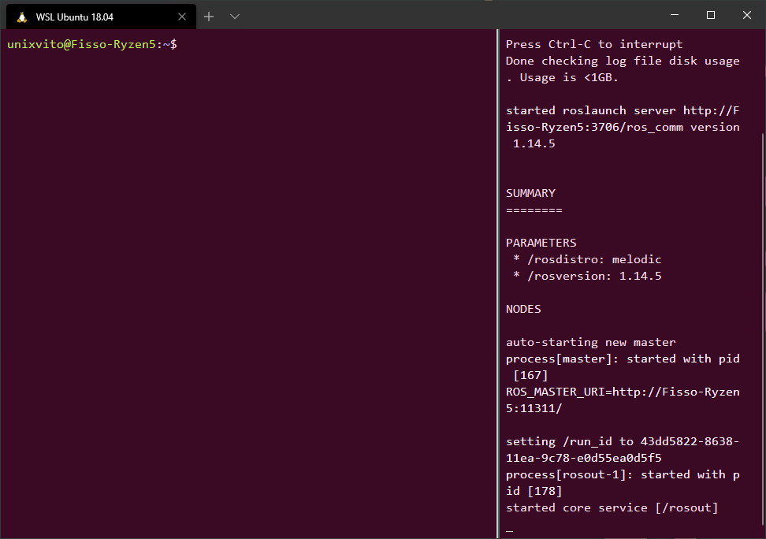

# Windows Terminal - Ubuntu like profile and color scheme
My personal Ubuntu theme on Windows Terminal  

## Global Settings
"defaultProfile": "*your_Ubuntu_guid*",  
"copyOnSelect": true,  
"copyFormatting": false,  
"requestedTheme": "dark",  
"snapToGridOnResize": false,  

## Default Profile Settings
"fontSize": 12,  
"historySize": 9001,  
"padding": "8, 8, 8, 8",  
"closeOnExit": "graceful",  
"suppressApplicationTitle": true,  
"snapOnInput": true,  
"useAcrylic": false  

## WSL Ubuntu 18.04 LTS Settings
"guid": "*your_Ubuntu_guid*",  
"hidden": false,  
"name": "WSL Ubuntu 18.04",  
"source": "Windows.Terminal.Wsl",  
"startingDirectory": "//wsl$/*add_default_folder*",  
"colorScheme": "MyUbuntuScheme",  
"fontFace": "Consolas",  
"antialiasingMode": "cleartype",  
"cursorShape": "underscore",  
"cursorColor": "#D3D7CF",  
"hidden": false   

## Color Scheme
"name": "MyUbuntuScheme",  
"foreground": "#D3D7CF",  
"background": "#3A0A24",  
"green": "#4E9A06",  
"blue": "#3465A4",  
"black": "#3A0A24",  
"cyan": "#06989A",  
"red": "#CC0000",  
"purple": "#75507B",  
"yellow": "#C4A000",  
"white": "#D3D7CF",  
"brightBlack": "#555753",  
"brightBlue": "#729FCF",  
"brightGreen": "#8AE234",  
"brightCyan": "#34E2E2",  
"brightRed": "#EF2929",  
"brightPurple": "#AD7FA8",  
"brightYellow": "#FCE94F",  
"brightWhite": "#EEEEEE"  

## Preview of the final result  
  